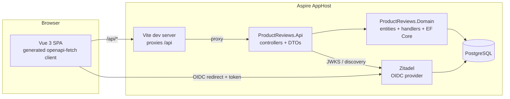

# Product Reviews — Technical Requirements

> How the application is built. What it must do, in product terms, lives in
> [business-requirements.md](business-requirements.md); pivotal decisions are
> recorded in [docs/adr](adr/README.md). This document and the ADRs are the
> spec — the implementation follows them, not the other way around.

## 1. Overview

A **.NET 10** backend, a **Vue 3** frontend, and **PostgreSQL**, orchestrated
locally by **.NET Aspire**. The whole point of the codebase is pervasive use
of [Kalicz.StrongTypes](https://github.com/KaliCZ/StrongTypes): every
constrained value is a strong type from the HTTP boundary through the domain
into the database and back out into the generated TypeScript client.

| Concern         | Choice                                                                 |
| --------------- | ---------------------------------------------------------------------- |
| Backend         | ASP.NET Core Web API, controllers (ADR-0001), C# 14 / `net10.0`         |
| Validation      | `Kalicz.StrongTypes` types only — no data annotations (ADR-0002)        |
| Error handling  | `Result<T, TError>` + per-operation error enums (ADR-0003)              |
| Persistence     | PostgreSQL via EF Core (Npgsql), `.UseStrongTypes()`                    |
| Auth            | Zitadel (OIDC, PKCE SPA client) + `JwtBearer` (ADR-0005)                |
| API docs        | Swashbuckle + `Kalicz.StrongTypes.OpenApi.Swashbuckle` (ADR-0004)       |
| Frontend        | Vue 3 + Vite + TypeScript SPA (ADR-0008)                                |
| Frontend client | Generated: `openapi-typescript` types + `openapi-fetch` runtime         |
| Orchestration   | .NET Aspire AppHost: Postgres, Zitadel, API, frontend                   |
| Backend tests   | xUnit + FsCheck (property) + Testcontainers Postgres (ADR-0007)         |
| Frontend tests  | Vitest (unit/component) + Playwright (E2E against the real stack)       |



## 2. Repository layout

```
.
├── docs/                          # this spec: requirements + ADRs
├── src/
│   ├── ProductReviews.AppHost/          # Aspire orchestration + Zitadel provisioning
│   ├── ProductReviews.ServiceDefaults/  # OTel, health checks, resilience (own namespace)
│   ├── ProductReviews.Api/
│   │   ├── Features/
│   │   │   ├── Catalog/                 # controller + response DTOs + mapping
│   │   │   ├── Reviews/                 # controller + request/response DTOs + mapping
│   │   │   ├── Votes/
│   │   │   └── Profile/                 # GET /api/me
│   │   ├── Infrastructure/              # one concern per file (§9)
│   │   └── Program.cs                   # thin orchestrator, calls the slices
│   └── ProductReviews.Domain/
│       ├── Catalog/                     # Product entity + catalog queries
│       ├── Reviews/                     # Review, Rating, submit/edit/delete handlers
│       ├── Votes/                       # ReviewVote + cast/remove handlers
│       └── Persistence/                 # DbContext, configurations, migrations, seeding
├── tests/
│   ├── ProductReviews.Domain.Tests/         # unit + FsCheck property tests
│   └── ProductReviews.Api.IntegrationTests/ # Testcontainers Postgres, wire-level
├── frontend/                         # Vue 3 + Vite SPA
│   ├── src/api/                      # generated schema types + typed client
│   ├── src/pages/  src/components/  src/auth/
│   └── tests/unit/  tests/e2e/       # Vitest, Playwright
├── Directory.Build.props             # TFM, LangVersion, analyzers — applies to all projects
├── Directory.Packages.props          # central package versions
└── ProductReviews.slnx
```

## 3. Key decisions

Each of these is an ADR; the numbered file is the authority:

- Feature slices in two projects, controllers, no MediatR, DTO layer owned by
  the API, proof-of-loading read models — [ADR-0001](adr/0001-vertical-slices-and-project-layout.md)
- Strong types are the only validation; no annotations, no guards — [ADR-0002](adr/0002-validation-lives-in-the-type-system.md)
- `Result<T, TError>` + error enums; controllers map to HTTP — [ADR-0003](adr/0003-business-errors-are-result-enums.md)
- OpenAPI is the frontend contract; client generated + drift-checked — [ADR-0004](adr/0004-openapi-is-the-frontend-contract.md)
- Zitadel OIDC + PKCE; `AuthorId` = SHA-256 of `sub` — [ADR-0005](adr/0005-auth-zitadel-oidc-pkce.md)
- Seeding at startup, never in migrations — [ADR-0006](adr/0006-seeding-at-startup-not-migrations.md)
- Real dependencies in tests, no mocks — [ADR-0007](adr/0007-tests-use-real-dependencies.md)
- Vue 3 + Vite SPA, same-origin proxy to the API — [ADR-0008](adr/0008-frontend-vue-spa.md)

## 4. Domain model

```mermaid
erDiagram
    Product ||--o{ Review : has
    Review ||--o{ ReviewVote : receives
    Product {
        long Id PK "from upstream catalog, never generated here"
        NonEmptyString Slug UK "max 100"
        NonEmptyString Name "max 200"
        NonEmptyString Description "max 4000"
        NonEmptyString ImageUrl "nullable, max 500"
        NonNegativeInt ReviewCount "denormalized"
        double AverageRating "nullable — null means no reviews yet"
        DateTime CreatedAtUtc
    }
    Review {
        Guid Id PK "UUIDv7 — doubles as created-at tiebreaker"
        long ProductId FK
        Guid AuthorId "hash of OIDC sub"
        NonEmptyString AuthorName "max 100, snapshot at write"
        Rating Rating "custom strong type, 1..5"
        NonEmptyString Title "max 200"
        NonEmptyString Body "max 4000"
        NonEmptyString Pros "nullable, max 500"
        NonEmptyString Cons "nullable, max 500"
        int Score "denormalized: upvotes - downvotes"
        DateTime CreatedAtUtc
        DateTime UpdatedAtUtc "nullable — set on first edit"
    }
    ReviewVote {
        Guid ReviewId PK_FK "composite PK with VoterId"
        Guid VoterId PK
        bool IsUpvote
        DateTime CreatedAtUtc
    }
```

Rules the schema enforces (the application enforces them first, with typed
errors; the constraints are the backstop):

- `uq_reviews_product_author` — unique `(ProductId, AuthorId)`: one review per
  reviewer per product. Deleting the review (hard delete, cascade to votes)
  frees the slot.
- `ReviewVote` composite PK `(ReviewId, VoterId)` — one vote per reviewer per
  review; changing a vote is an update, withdrawing is a delete.
- Covering indexes for the three review sort orders on
  `(ProductId, Score, Id)`, `(ProductId, Rating, Score, Id)`, and the PK
  ordering for "newest" (UUIDv7 ids are time-ordered).

Denormalized aggregates (`Product.ReviewCount`, `Product.AverageRating`,
`Review.Score`) are **always recomputed from source rows** inside the same
`SaveChanges` as the mutation that changed them — never incremented in place,
so they self-heal and cannot drift. `AverageRating` is `null` when a product
has no reviews (business rule: "not yet rated", never zero).

**`Rating` is our own strong type** — a `[NumericWrapper]` readonly partial
struct over `int` with `TryCreate` accepting 1–5, JSON-converted like the
built-ins. It exists to demonstrate that consumer codebases define their own
wrappers with the same three-line recipe the library uses internally.

## 5. Domain operations

One file per operation in `ProductReviews.Domain`, named `<Verb><Noun>.cs`,
containing the handler class and, when the operation can fail, its error enum
(ADR-0003):

| Operation        | Signature (conceptually)                                                | Errors                            |
| ---------------- | ----------------------------------------------------------------------- | --------------------------------- |
| `GetCatalog`     | `() → IReadOnlyList<Product>`                                            | —                                 |
| `GetProductDetail` | `(slug, viewer?) → ProductDetailModel?`                                | `null` = unknown product          |
| `GetReviewsPage` | `(slug, sort, ratingFilter, page, pageSize, viewer?) → ReviewsPageModel?` | `null` = unknown product          |
| `SubmitReview`   | `(slug, author, rating, title, body, pros?, cons?) → Result<Review, SubmitReviewError>` | `ProductNotFound`, `AlreadyReviewed` |
| `EditReview`     | `(reviewId, author, rating?, title?, body?, Maybe<pros>?, Maybe<cons>?) → Result<Review, EditReviewError>` | `ReviewNotFound`, `NotYourReview` |
| `DeleteReview`   | `(reviewId, author) → DeleteReviewError?` (`null` = success)             | `ReviewNotFound`, `NotYourReview` |
| `CastVote`       | `(reviewId, voter, isUpvote) → Result<VoteModel, CastVoteError>`         | `ReviewNotFound`, `OwnReview`     |
| `RemoveVote`     | `(reviewId, voter) → Result<VoteModel, RemoveVoteError>`                 | `ReviewNotFound`                  |

Conventions:

- Handlers take strong types (`NonEmptyString slug`, `Rating rating`) — a
  handler signature is its precondition list.
- `EditReview` is the `Maybe<T>` showcase: required fields use `T?`
  (null = leave unchanged); the clearable optional fields (`Pros`, `Cons`)
  use `Maybe<NonEmptyString>?` — `null` = leave unchanged, `None` = clear,
  `Some(x)` = set. Mutations go through entity methods, never property
  spraying from the handler.
- Operations that fail without a success payload return a nullable error enum
  instead of a `Result` — the library's own guidance (don't reach for `Result`
  when there is nothing to return on success).
- Read models are constructed from a single query with a fixed `Include`/
  projection — e.g. `ReviewWithViewerContext(Review, bool Mine, bool? MyVote)`
  — so a constructed model *proves* its data was loaded (ADR-0001).

## 6. API surface

All routes under `/api`. Reads are anonymous; writes carry `[Authorize]`
(per-action — no blanket `RequireAuthorization`). Route/query parameters bind
strong types via their `IParsable` implementations; bodies bind via the
built-in JSON converters. Invalid input never reaches an action: it becomes a
400 `ValidationProblemDetails` from the `[ApiController]` pipeline, with error
keys normalized by `Kalicz.StrongTypes.AspNetCore`.

| Endpoint | Auth | Request | Response |
| --- | --- | --- | --- |
| `GET /api/products` | — | — | `ProductSummaryResponse[]` |
| `GET /api/products/{slug}` | — | — | `ProductDetailResponse` (includes `myReviewId` for signed-in viewers) / 404 |
| `GET /api/products/{slug}/reviews` | — | `sort` (`mostHelpful` default \| `newest` \| `highestRating` \| `lowestRating`), `ratings` (repeatable 1–5), `page`, `pageSize` (`Positive<int>?`, defaults 1/10, page size capped at 50) | `ReviewsPageResponse` / 404 |
| `POST /api/products/{slug}/reviews` | ✔ | `SubmitReviewRequest` | 201 `ReviewResponse`; 404 unknown product; 409 already reviewed |
| `PATCH /api/reviews/{id}` | ✔ | `EditReviewRequest` (PATCH semantics, §5) | 200 `ReviewResponse`; 404; 403 not the author |
| `DELETE /api/reviews/{id}` | ✔ | — | 204; 404; 403 not the author |
| `PUT /api/reviews/{id}/vote` | ✔ | `CastVoteRequest { isUpvote }` | 200 `VoteResponse { score, myVote }`; 404; 400 own review |
| `DELETE /api/reviews/{id}/vote` | ✔ | — | 200 `VoteResponse { score, myVote: null }`; 404 |
| `GET /api/me` | ✔ | — | `ProfileResponse { displayName, email?, authorId }` |

DTO rules:

- DTO properties are strong types; **optionality is encoded in nullability
  and nowhere else**. A required property is non-nullable in C#, `required` +
  non-nullable in the OpenAPI schema; an optional one is nullable in both.
  The generated TypeScript mirrors this exactly (ADR-0004).
- API enums (`ReviewSort`) serialize as strings, are declared in the API
  layer, and map to domain enums with exhaustive switches — domain enums are
  never exposed on the wire.
- Error enum → HTTP mapping lives next to the controller as an exhaustive
  `switch` (no `default` arm): input-shaped failures become
  `ValidationProblem` with a field key; missing resources become 404;
  ownership violations become 403; duplicates become 409.

## 7. Auth (summary — ADR-0005 is the authority)

Zitadel runs as an Aspire-managed container; the AppHost idempotently
provisions the org/project/PKCE SPA client and two demo users, and injects
authority/client-id into the API and frontend. The SPA uses `oidc-client-ts`
redirect flow; the API validates JWTs with `JwtBearer`. `AuthorId` is the
SHA-256-derived Guid of `sub`; `AuthorName` snapshots the `name` claim.
Integration tests mint their own JWTs against the same validation pipeline
with a test signing key; E2E tests log in through the real Zitadel form.

## 8. Frontend

- Vue 3 `<script setup>` + TypeScript, Vue Router
  (`/`, `/products/:slug`, `/auth/callback`), Pinia for the auth session only.
- **Every** API call goes through the `openapi-fetch` client typed by the
  generated `schema.d.ts`. Regenerate with `npm run generate:api` (reads the
  committed `openapi.json` snapshot; the drift test keeps the snapshot
  honest).
- The Vite dev server (and preview server in E2E) proxies `/api` to the
  backend using the `API_PROXY_TARGET` environment variable injected by
  Aspire.
- UI derives its client-side hints (required fields, rating bounds, max
  lengths) from the generated types/schema instead of restating them.

## 9. Cross-cutting infrastructure (API)

One concern, one file, in `ProductReviews.Api/Infrastructure/` — each a static
class with `Configure(builder)` and, where middleware exists, `Use(app)`:

| File               | Owns                                                             |
| ------------------ | ---------------------------------------------------------------- |
| `Authentication.cs` | JwtBearer against Zitadel authority, `CurrentUser` accessor      |
| `OpenApi.cs`       | Swagger UI + `AddStrongTypes()` + `Rating` schema mapping         |
| `RateLimits.cs`    | Fixed-window limiter on write endpoints                           |
| `ErrorHandling.cs` | Consistent RFC 7807 output for unhandled failures                 |
| `Observability.cs` | Health checks (`/health`, `/alive`, DbContext check)              |

OpenTelemetry, service discovery, and HTTP resilience come from
`ProductReviews.ServiceDefaults` — which lives in its **own** namespace
(`ProductReviews.ServiceDefaults`), not a hijacked framework namespace.

## 10. Local development & orchestration

- **One command:** `aspire run` (or `dotnet run --project
  src/ProductReviews.AppHost`). The AppHost starts Postgres (two logical
  databases: `productreviews`, `zitadel`), Zitadel (+ its login UI
  container), the API, and the frontend dev server; installs frontend
  dependencies on first run; provisions Zitadel; and opens the dashboard.
- The API migrates (`MigrateAsync`) and seeds (ADR-0006) at startup in
  Development. Ten products with reviews and votes are browsable immediately.
- Fixed ports where the browser needs stability (Zitadel issuer `:8090`,
  frontend `:5173` dev / `:4173` E2E); everything else is dynamic and flows
  through Aspire references.
- Demo credentials live in the README.

## 11. Testing

| Suite | Project / tool | What it proves |
| --- | --- | --- |
| Domain unit | `ProductReviews.Domain.Tests` (xUnit) | Entity behavior and invariants — pure, no I/O |
| Property | same project, FsCheck + `Kalicz.StrongTypes.FsCheck` | Invariants hold across generated strong-typed inputs (score arithmetic, edit semantics, rating bounds) |
| API integration | `ProductReviews.Api.IntegrationTests` (xUnit, Testcontainers) | Wire-level behavior against real Postgres: contracts, constraints, error mapping, OpenAPI content |
| Frontend unit | Vitest + Vue Test Utils | Component logic; PATCH body construction (three-state semantics) |
| E2E | Playwright | Whole stack via Aspire: browse → sign in → review → vote |

Test conventions: `Method_Condition_ExpectedResult` naming; integration tests
send anonymous objects and assert on raw `JsonElement`s (contract renames must
fail tests); one shared Postgres container per run, isolation via unique data
per test; no mocking anywhere (ADR-0007). The OpenAPI document itself is
asserted in integration tests (email format, `minLength`, `exclusiveMinimum`,
rating bounds) — it is the demo's headline claim.

**Tests never reshape production code.** We use DDD: the domain model is
designed for the domain, not for testability. If a test needs some
capability, the test figures out how to achieve it — never add methods,
parameters, setters, or hooks to production code just so a test can reach
something. Dependency injection should be enough; otherwise the test
manipulates state itself (seeding through EF, reflection as a last resort).

## 12. Coding conventions

- **Naming:** UTC instants end in `Utc` (`CreatedAtUtc`); identifiers are
  spelled out in full — no abbreviations; private fields are camelCase without
  an underscore prefix, while private constants and static readonly fields are
  PascalCase.
- **No nested local functions — write a normal method.** Don't reach for
  local functions; extract a private method instead. A one-liner local
  function can occasionally be acceptable, but that's an edge case, not
  something to aim for.
- **Entity Framework: set the navigation property together with the FK.**
  When assigning a relationship by ID (e.g. `ProductId`), also assign the
  navigation property (`Product`) — in constructors, factory methods, and
  setters alike — so that right after the call, `something.Product` is usable
  and non-null. The exception is performance-sensitive work like inserting
  thousands of rows in a batch: there it's fine to set only the ID rather
  than load entities into memory that nothing will read.
- **Comments** only where they capture a non-obvious *why*; when in doubt,
  none.
- **Exhaustive switches:** enum switch expressions never have a `default`/`_`
  arm; `CS8509` is a build error so a new enum member breaks every mapping
  that ignores it.
- `.editorconfig` promotes correctness analyzers to build errors
  (`EnforceCodeStyleInBuild`) and demotes pure style to suggestions; nullable
  reference types are on everywhere and null-safety warnings are errors.
- Central package management (`Directory.Packages.props`); `net10.0`,
  `LangVersion` 14 via `Directory.Build.props`.
